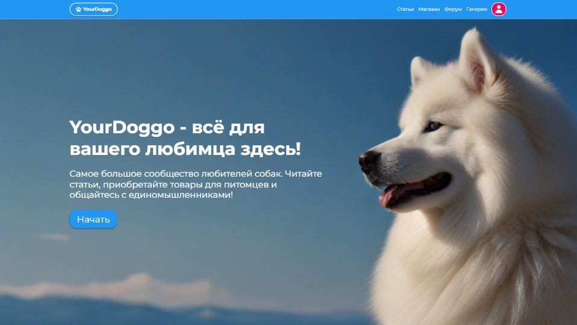

## YourDoggo - сайт для владельцев собак

Демо: https://ivanzemsky.github.io/YourDoggo/

Сайт создан для пользователей-владельцев собак. Он включает магазин товаров, статьи, галерею изображений пользователей и возможность общаться на форуме, оставлять отзывы и комментарии

<picture>
 
</picture>

### Стек технологий:
+ React 18 (TypeScript)
+ Redux Toolkit, RTK Query
+ SCSS (modules)
+ Jest
+ Express
+ MongoDB (Mongoose)
+ Webpack
+ react-hook-form
+ react-responsive
+ react-transition-group

### Сторонние ресурсы:
+ [Render](https://render.com/) - для хостинга бекенда
+ [MongoDB Atlas](https://www.mongodb.com/atlas) - для хостинга базы данных
+ [Unsplash](https://unsplash.com/) - для изображений галереи
+ [Leonardo.ai](https://leonardo.ai/) - для создания изображений товаров
+ [Imgur](https://imgur.com/) - для хранения изображений товаров

### Аккаунты
| Логин         | Пароль        |
| ------------- |---------------|
| YellowDog     | 1234567       |
| Dogg          | 123456        |
| dogRed        | 654321        |
| Samoyed       | 1234567       |
| SnowyDoggo    | 123456        |
| WhiteDog      | 1234567       |

### Установка
1. Склонируйте репозиторий:
```git clone https://github.com/IvanZemsky/YourDoggo.git [директория]```
2. Выполните установку пакетов:
```npm install ```
3. Запустите проект:
```npm start```
